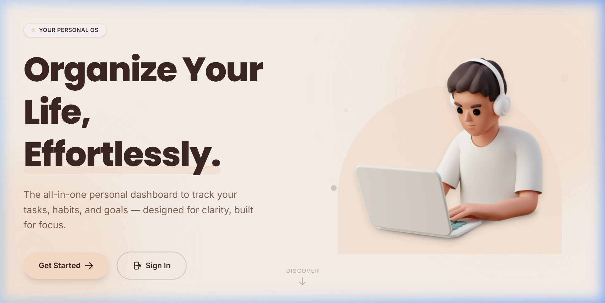
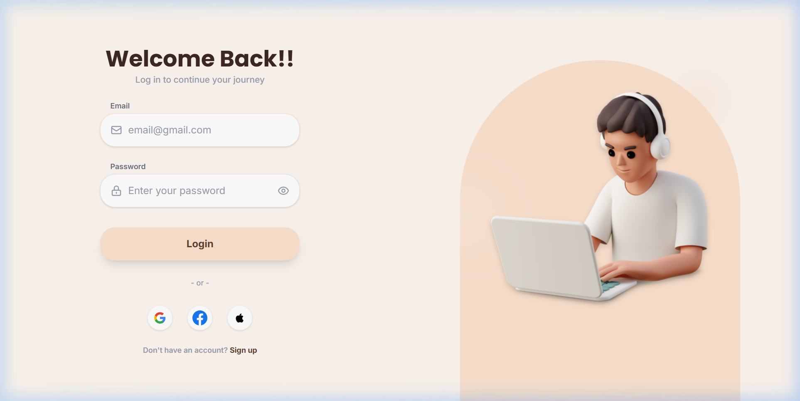
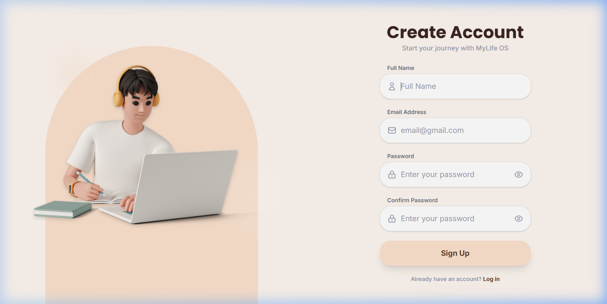
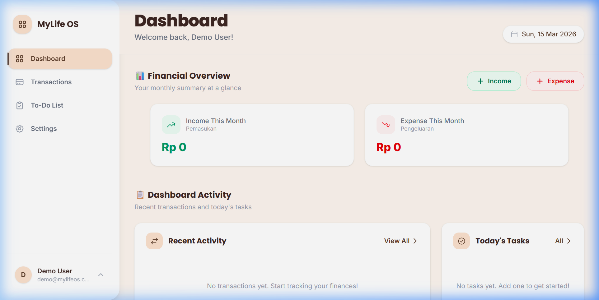
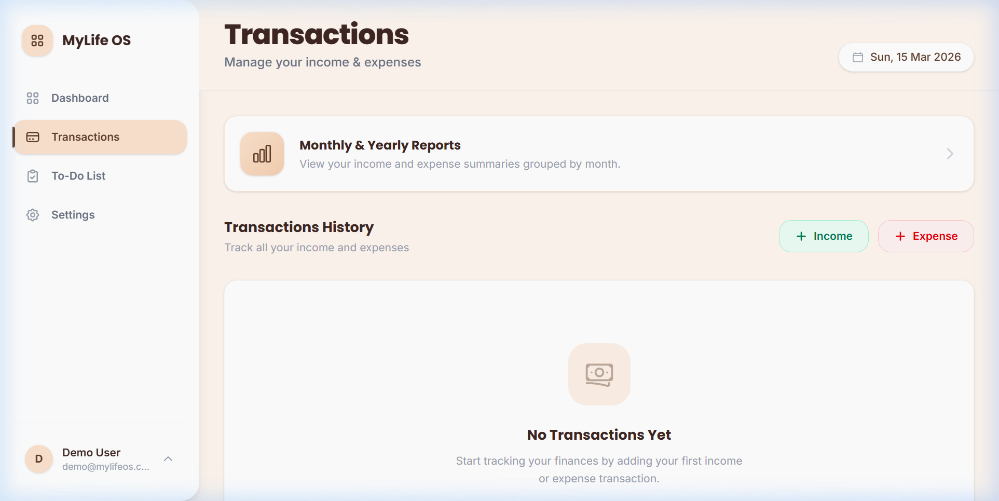
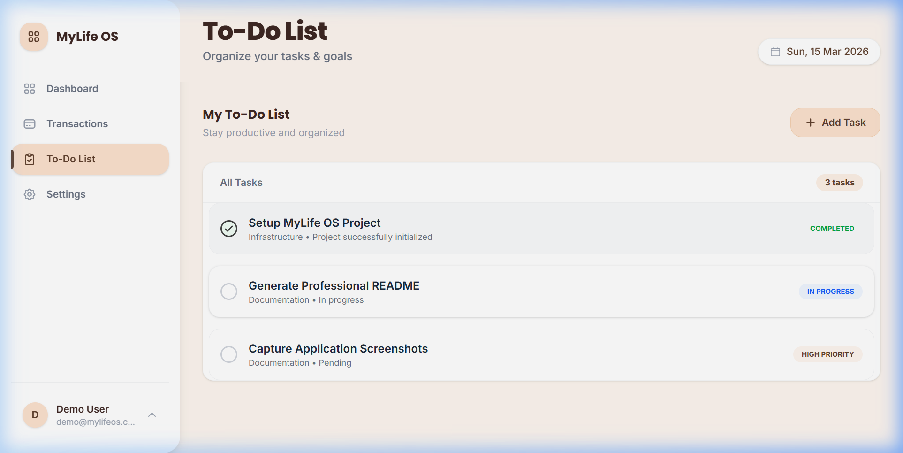
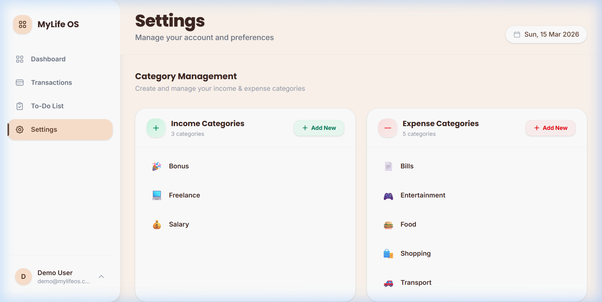
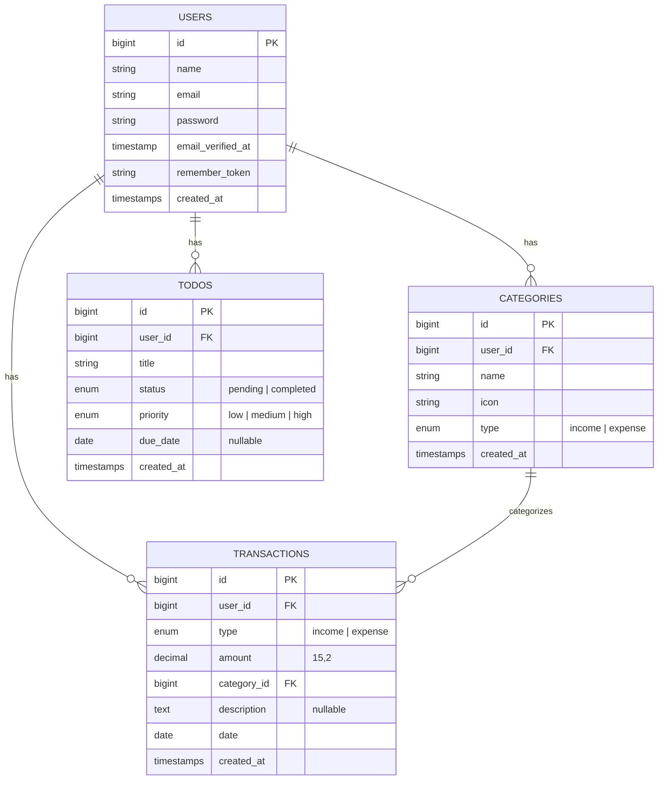

<p align="center">
  
</p>

<h1 align="center">🧠 MyLife OS</h1>

<p align="center">
  <em>Organize Your Life, Effortlessly.</em>
</p>

<p align="center">
  
  
  
  
  
</p>

<p align="center">
  
  
</p>

---

## 📖 Tentang Project

**MyLife OS** adalah aplikasi web manajemen kehidupan pribadi yang dirancang sebagai *personal operating system* untuk membantu kamu mengatur keuangan, mengelola tugas harian, dan mencapai tujuan hidup — semua dalam satu dashboard yang bersih dan modern.

Dibangun dengan **Laravel 12**, **Tailwind CSS v4**, dan **Alpine.js**, aplikasi ini menggabungkan performa tinggi di sisi server dengan antarmuka pengguna yang responsif dan interaktif tanpa memerlukan framework JavaScript yang berat.

### ✨ Mengapa MyLife OS?

| | Fitur | Deskripsi |
|---|---|---|
| 📊 | **Dashboard Terpusat** | Lihat ringkasan keuangan dan aktivitas terbaru dalam satu halaman |
| 💰 | **Manajemen Keuangan** | Catat pemasukan & pengeluaran dengan kategori kustom |
| ✅ | **To-Do List** | Kelola tugas harian dengan prioritas dan deadline |
| ⚙️ | **Pengaturan Fleksibel** | Kustomisasi kategori transaksi dengan emoji icon |
| 📱 | **Fully Responsive** | Tampilan sempurna di desktop, tablet, dan mobile |

---

## 📸 Demo Aplikasi

Berikut adalah tampilan dari setiap halaman yang ada di MyLife OS:

### 🏠 Landing Page
Halaman utama yang menyambut pengguna dengan desain modern dan CTA untuk memulai.

<p align="center">
  
</p>

---

### 🔑 Login & Register

<table>
  <tr>
    <td width="50%">
      <p align="center"><strong>Halaman Login</strong></p>
      
    </td>
    <td width="50%">
      <p align="center"><strong>Halaman Register</strong></p>
      
    </td>
  </tr>
</table>

---

### 📊 Dashboard
Dashboard utama menampilkan ringkasan keuangan bulanan, transaksi terakhir, dan daftar tugas hari ini.

<p align="center">
  
</p>

---

### 💰 Transactions
Halaman pencatatan transaksi pemasukan dan pengeluaran beserta tombol aksi cepat.

<p align="center">
  
</p>

---

### ✅ To-Do List
Kelola tugas harian dengan status, prioritas, dan progress tracking.

<p align="center">
  
</p>

---

### ⚙️ Settings
Kustomisasi kategori pemasukan dan pengeluaran dengan emoji icon.

<p align="center">
  
</p>

---

## 🚀 Fitur Utama

### 🔐 Autentikasi
- Registrasi akun baru dengan validasi lengkap
- Login dengan opsi "Remember Me"
- Logout aman dengan session invalidation
- Setiap user baru otomatis mendapat kategori default (Salary, Freelance, Food, Transport, dll.)

### 📊 Dashboard
- **Ringkasan Keuangan Bulanan** — Total pemasukan dan pengeluaran bulan ini
- **Format Rupiah Cerdas** — Otomatis disingkat menjadi format seperti `6,92 Juta` atau `1,5 Miliar`
- **Transaksi Terakhir** — 5 transaksi terbaru beserta ikon kategori
- **Daftar Todo** — Semua tugas yang perlu diselesaikan

### 💰 Manajemen Transaksi
- Tambah transaksi pemasukan (income) atau pengeluaran (expense)
- Setiap transaksi terhubung ke kategori dengan ikon emoji
- Pencatatan jumlah, tanggal, kategori, dan deskripsi opsional
- **Laporan Ringkasan** — Rangkuman bulanan & tahunan yang dikelompokkan otomatis
- Pengurutan otomatis berdasarkan tanggal terbaru

### ✅ To-Do List
- Buat tugas baru dengan judul, prioritas (High / Medium / Low), dan deadline
- **Toggle Completion** — Klik checkbox untuk menandai tugas selesai secara real-time (AJAX)
- Edit tugas yang sudah ada melalui modal
- Hapus tugas dengan konfirmasi modal yang elegan
- Auto-sort: tugas pending selalu tampil di atas

### ⚙️ Pengaturan (Settings)
- Kelola kategori pemasukan dan pengeluaran
- Setiap kategori memiliki **nama** dan **ikon emoji** kustom
- Tambah, edit, dan hapus kategori
- Kategori digunakan di seluruh aplikasi (transaksi, dashboard)

---

## 🛠️ Tech Stack

| Layer | Teknologi | Versi |
|---|---|---|
| **Backend** | Laravel | 12.x |
| **Frontend** | Blade Templates + Alpine.js | 3.x |
| **Styling** | Tailwind CSS | 4.x |
| **Build Tool** | Vite | 7.x |
| **Database** | SQLite (default) / MySQL / PostgreSQL | — |
| **Bahasa** | PHP | 8.2+ |
| **Font** | Inter & Poppins (Google Fonts) | — |

---

## 📂 Struktur Project

```
MyLife OS/
├── app/
│   ├── Http/Controllers/
│   │   ├── AuthController.php          # Autentikasi (login, register, logout)
│   │   ├── DashboardController.php     # Halaman dashboard & ringkasan keuangan
│   │   ├── SettingsController.php      # Manajemen kategori
│   │   ├── TodoController.php          # CRUD & toggle to-do list
│   │   └── TransactionController.php   # CRUD transaksi & laporan ringkasan
│   ├── Models/
│   │   ├── Category.php                # Model kategori (income/expense)
│   │   ├── Todo.php                    # Model tugas/to-do
│   │   ├── Transaction.php             # Model transaksi keuangan
│   │   └── User.php                    # Model pengguna
│   └── Providers/
├── database/
│   └── migrations/                     # Schema database
├── resources/
│   ├── css/app.css                     # Stylesheet utama
│   ├── js/app.js                       # JavaScript utama
│   └── views/
│       ├── auth/                       # Halaman login & register
│       ├── components/                 # Komponen Blade reusable
│       ├── layouts/app.blade.php       # Layout utama + sidebar + modals
│       ├── partials/                   # Partial views (modals, dll.)
│       ├── dashboard.blade.php         # Halaman dashboard
│       ├── transactions.blade.php      # Daftar transaksi
│       ├── transactions-summary.blade.php  # Laporan ringkasan
│       ├── todo.blade.php              # Halaman to-do list
│       ├── settings.blade.php          # Halaman pengaturan kategori
│       └── welcome.blade.php           # Landing page
├── routes/
│   └── web.php                         # Definisi semua routes
├── public/
│   └── assets/                         # Asset statis (gambar, ikon)
├── composer.json                       # Dependensi PHP
├── package.json                        # Dependensi Node.js
└── vite.config.js                      # Konfigurasi Vite
```

---

## 📋 Prasyarat

Pastikan kamu sudah menginstal software berikut di komputer:

| Software | Versi Minimum | Cek Versi |
|---|---|---|
| **PHP** | 8.2 | `php -v` |
| **Composer** | 2.x | `composer -V` |
| **Node.js** | 18.x | `node -v` |
| **npm** | 9.x | `npm -v` |

> [!NOTE]
> Secara default, project ini menggunakan **SQLite** sebagai database. Tidak perlu install MySQL atau PostgreSQL kecuali kamu ingin menggantinya.

---

## ⚡ Instalasi & Setup

### 1. Clone Repository

```bash
git clone https://github.com/mohammadakbarr18/MyLife-OS.git
cd MyLife-OS
```

### 2. Install Dependensi PHP

```bash
composer install
```

### 3. Install Dependensi Node.js

```bash
npm install
```

### 4. Konfigurasi Environment

```bash
cp .env.example .env
```

Lalu generate application key:

```bash
php artisan key:generate
```

### 5. Setup Database

Secara default, project ini menggunakan **SQLite**. File database akan otomatis dibuat saat migrasi. Jalankan migrasi:

```bash
php artisan migrate
```

> [!TIP]
> Jika kamu ingin menggunakan **MySQL** atau **PostgreSQL**, ubah konfigurasi `DB_CONNECTION` dan parameter database lainnya di file `.env` sebelum menjalankan migrasi.

### 6. Jalankan Aplikasi

Buka **dua terminal** dan jalankan masing-masing perintah berikut:

**Terminal 1 — Laravel Server:**
```bash
php artisan serve
```

**Terminal 2 — Vite Dev Server:**
```bash
npm run dev
```

**Atau**, gunakan satu perintah untuk menjalankan semuanya sekaligus:

```bash
composer dev
```

### 7. Buka di Browser

```
http://localhost:8000
```

🎉 **Selesai!** Kamu akan disambut oleh landing page MyLife OS.

---

## 🗄️ Skema Database



---

## 🛣️ Routes / API Endpoints

| Method | URI | Aksi | Deskripsi |
|---|---|---|---|
| `GET` | `/` | — | Landing page / redirect ke dashboard |
| `GET` | `/login` | — | Halaman login |
| `POST` | `/login` | `AuthController@login` | Proses login |
| `GET` | `/register` | — | Halaman registrasi |
| `POST` | `/register` | `AuthController@register` | Proses registrasi |
| `POST` | `/logout` | `AuthController@logout` | Logout |
| `GET` | `/dashboard` | `DashboardController@index` | Dashboard utama |
| `GET` | `/transactions` | `TransactionController@index` | Daftar transaksi |
| `POST` | `/transactions` | `TransactionController@store` | Tambah transaksi |
| `GET` | `/transactions/summary` | `TransactionController@summary` | Laporan ringkasan |
| `GET` | `/todo` | `TodoController@index` | Daftar to-do |
| `POST` | `/todo` | `TodoController@store` | Tambah tugas |
| `PATCH` | `/todo/{id}/toggle` | `TodoController@toggle` | Toggle status tugas |
| `PUT` | `/todo/{id}` | `TodoController@update` | Update tugas |
| `DELETE` | `/todo/{id}` | `TodoController@destroy` | Hapus tugas |
| `GET` | `/settings` | `SettingsController@index` | Halaman pengaturan |
| `POST` | `/settings/categories` | `SettingsController@storeCategory` | Tambah kategori |
| `PUT` | `/settings/categories/{id}` | `SettingsController@updateCategory` | Update kategori |
| `DELETE` | `/settings/categories/{id}` | `SettingsController@destroyCategory` | Hapus kategori |

---

## 🎨 Desain & UI/UX

MyLife OS menggunakan desain yang **warm, clean, dan modern** dengan palet warna utama:

| Warna | Hex | Penggunaan |
|---|---|---|
| 🟫 Coklat Tua | `#3E2723` | Teks utama & heading |
| 🍑 Peach | `#FCE2CE` | Aksen, tombol, sidebar aktif |
| 🫘 Coklat Sedang | `#5F402D` | Teks sekunder & ikon |
| 🥚 Krem | `#FEF6EF` | Warna background utama |

### Fitur UI Utama:
- **Sidebar navigasi** (desktop) + **Bottom navigation bar** (mobile)
- **Modal interaktif** dengan animasi smooth menggunakan Alpine.js
- **Glassmorphism** pada elemen-elemen tertentu
- **Responsive design** — Mobile-first approach
- **Custom font** — Inter untuk body text, Poppins untuk heading

---

## 🧪 Testing

Jalankan test suite bawaan Laravel:

```bash
php artisan test
```

Atau menggunakan PHPUnit secara langsung:

```bash
./vendor/bin/phpunit
```

---

## 📦 Build untuk Production

Untuk build asset production:

```bash
npm run build
```

Kemudian pastikan konfigurasi `.env` production sudah benar:

```env
APP_ENV=production
APP_DEBUG=false
APP_URL=https://your-domain.com
```

Jalankan optimisasi Laravel:

```bash
php artisan config:cache
php artisan route:cache
php artisan view:cache
```

---

## 🤝 Kontribusi

Kontribusi sangat diterima! Ikuti langkah berikut:

1. **Fork** repository ini
2. Buat **branch** fitur baru (`git checkout -b fitur/fitur-baru`)
3. **Commit** perubahan (`git commit -m 'Menambahkan fitur baru'`)
4. **Push** ke branch (`git push origin fitur/fitur-baru`)
5. Buat **Pull Request**

> [!IMPORTANT]
> Pastikan kode kamu mengikuti standar coding PSR-12 dan semua test tetap passed sebelum membuat PR.

---

## 📄 Lisensi

Project ini dilisensikan di bawah [MIT License](https://opensource.org/licenses/MIT) — bebas digunakan, dimodifikasi, dan didistribusikan.

---

<p align="center">
  Dibuat dengan ❤️ oleh <strong>Mohammad Akbar</strong>
</p>

<p align="center">
  <em>Organize. Track. Achieve.</em>
</p>
